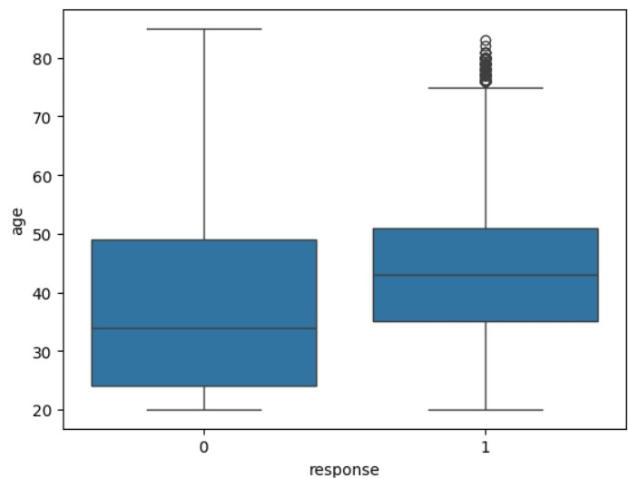
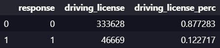
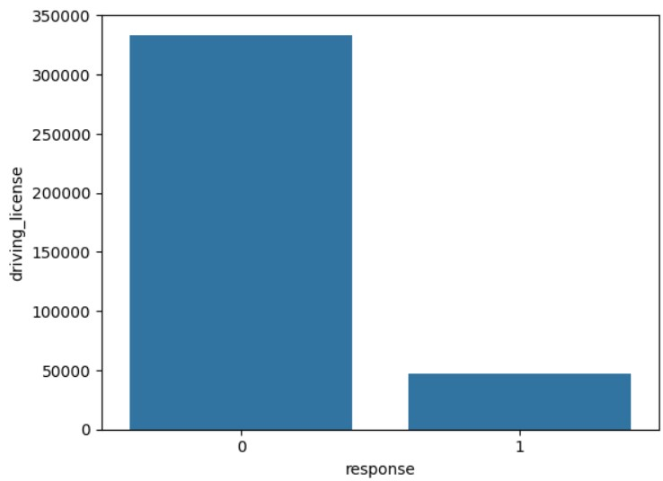
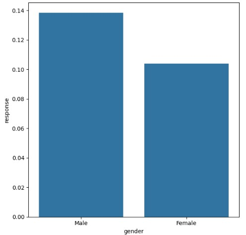
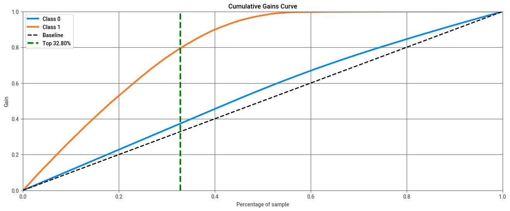
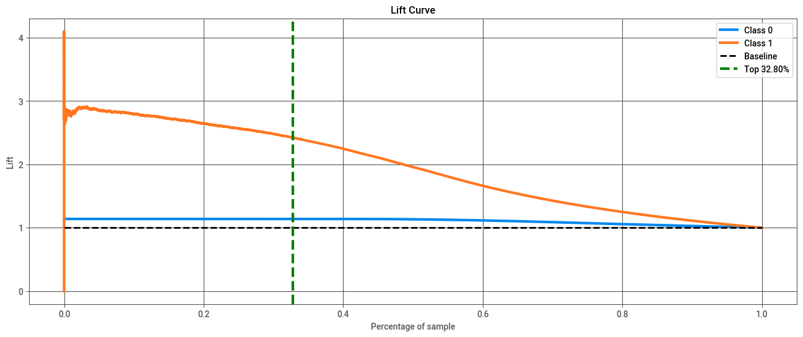

# Health Insurance Cross-Sell

## This project aims to rank a list of potential customers based on their likelihood of purchasing car insurance (propensity score).

#### This project was made by Felipe Valory.

# 1. Business Problem

The dataset is about an Insurance company that has provided Health Insurance to its customers. The goal is to predict which customers are most likely to buy car insurance by ranking them. This will allow the sales team to focus their efforts on the most promising customers, optimizing resources and increasing revenue compared to a random approach.

# 2. Business Assumptions

- The data is imbalanced, with a significantly lower proportion of customers interested in car insurance.
- Each car insurance policy generates an average revenue of $1,000 per customer.
- An efficient ranking increases conversion chances and reduces customer acquisition costs.

# 3. Solution Strategy

My strategy to solve this challenge was:

**Step 01. Data Description:**

Initial analysis of the data provided by the company, including the distribution of variables and identification of missing values.

**Step 02. Feature Engineering:**

Creation and transformation of relevant variables to enhance the predictive power of the model.

**Step 03. Data Filtering:**

Removal of outliers and handling of data inconsistencies.

**Step 04. Exploratory Data Analysis:**

Identification of relationships between variables and understanding customer behavioral patterns.

**Step 05. Data Preparation:**

Normalization, encoding categorical variables, and splitting data into training and testing sets.

**Step 06. Feature Selection:**

Identification of the most important variables for model performance.

**Step 07. Machine Learning Modelling:**

Training machine learning models to predict the likelihood of car insurance purchase.

**Step 08. Cross-Validation:**

Implemented 5-fold cross-validation with stratified sampling to maintain class distribution across folds.

**Step 09. Convert Model Performance to Business Values:**

Converting model results into tangible insights, such as expected revenue increase.

# 4. Top 3 Data Insights

- A large part of the probability of purchasing vehicle insurance is among customers aged 35-50

- There are many people with a driving license who do not want car insurance.

- 14% of all men and 10% of women would buy a vehicle insurance

# 5. Machine Learning Model Applied

The main model used was the XGBoost, which showed excellent performance in classifying potential customers. Additional models like Random Forest and KNN were also tested for comparison.

# 6. Machine Learning Model Performance

- **Recall at K (average):** 79,48%

# 7. Business Results

The results show that the model is effective at ranking customers, significantly increasing conversion compared to a random approach.

- 33% of the customer base, ordered by purchase probability, contains 80% of all those interested in purchasing vehicle insurance.
- This corresponds to 20 thousand calls from the sales team.
- The proposed model is 2.5x better than a random choice.
- If we adopt 1000 dollars for each insurance, this model will achieve about US$ 26 million more in revenue than a random choice.

# 8. Conclusions

The project demonstrated that using machine learning can transform a traditional sales process, bringing significant efficiency and revenue gains. The generated ranking allows the sales team to focus on customers with a higher likelihood of conversion, optimizing efforts and increasing ROI.

# 9. Lessons Learned

- How cross-validation is important for the effectiveness of the model.
- Translating technical results into business insights is key to project success.
- Integration between technical and sales teams is crucial for business impact.

# 10. Next Steps to Improve

- Treat imbalanced data to avoid model biases.
- Create a final ranking for the sales team and deploying the solution in production.
- Develop an interactive dashboard for the sales team to track results in real-time.
